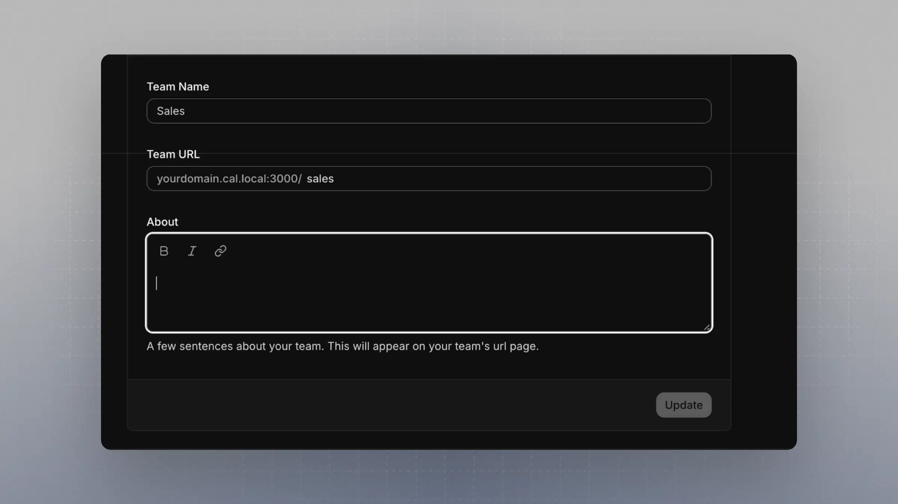

This guide walks you through how to set up a Round Robin Team Event that routes bookings to team members based on attributes using Cal.com's Routing Forms.

<Note>Attributes are only available in Organizations Plan and Enterprise Plan</Note>

---

## Setting Up a Round Robin Team Event

1. **Ensure a Team exists**
   If not already created, go to your organization and create a Team. For example, a team named `Sales` with the slug `sales`.
      

1. **Create a Round Robin Event Type**
   - Create this event under the team you just set up.
      
   - **Important**: Enable the setting `Add all team members, including future members`. This ensures team members are selected dynamically based on attributes.
         

---

## Creating an Attribute

Attributes let you define filters that team members can be matched against.

1. Go to [Organization Attributes](https://app.cal.com/settings/organizations/attributes)
2. Create one or more attributes.
   - For matching use cases, **Multi Select** is a great option—especially when team members might belong to multiple attribute values.
   - Example: Create an attribute with the name `Service (Attribute)` to clearly indicate it's used in attribute-based routing.
   
3. **Assign the attribute** to one or more team members. **This step is critical**.
   
---

## Setting Up a Routing Form

1. Navigate to [Routing Forms](https://app.cal.com/routing)
2. Create a new Routing Form **under the same team** as your event type.
   
3. Add fields that you want bookers to fill out.
   - It's recommended to include an `Email` field with the identifier `email` to enable integrations with CRMs and contact lookup tools.
   - Refer to [this guide](https://cal.com/help/apps-and-integrations/assign-people#option-2-based-on-emails) for more.
4. Create another field that matches the **options** from the attribute you set up.
   - The **name and identifier don't have to match** the attribute name.
   - Example: A `Service` field with identifier `service`, where the options are identical to those in `Service (Attribute)`.
   

---

## Connecting the RR Team Event, Attributes, and Routing Form

1. In your Routing Form, go to the **Routing** tab
2. Click `Add a new Route`
3. Link the Routing Form field to the corresponding Attribute
   - For example, connect the `Service (Attribute)` to the `Service` field in your Routing Form
   

4. Click **Test Preview** on the left
   - Input a value that exists in both the Routing Form field and the Attribute
   - The system should now route the booking to a team member with that value assigned in their attributes
   
---

## Sending Leads or Visitors to the Router

There are two ways to use the Routing setup for collecting bookings:

### 1. Using the Cal.com Routing Form Public Page

- You can find the public link for your Routing Form in the UI
   
- The URL will look like:

```
app.cal.com/forms/{FORM_ID}
```

Share this link with your leads or embed it in your site.


### 2. Using Your Own Form with Headless Router (Embed Mode)

If you prefer to design your own form UI but still leverage Cal.com routing:

- Use the Headless Router endpoint:

```
/router?form={FORM_ID}&service=Service%20Type%201&email=jane@example.com
```

- The field identifiers become query params in the URL
- Cal.com will handle the routing and direct the user to the appropriate booking page

This gives you full control over your form UI while keeping Cal.com as the routing engine.

---

You’ve now set up a powerful attribute-based Round Robin routing system that integrates seamlessly with your team structure and forms.

